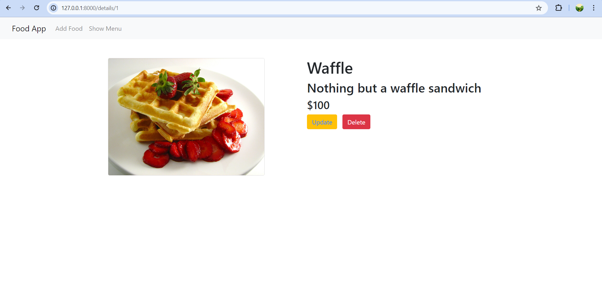

# Django Food Menu App
## Overview
The Django Food Menu App simplifies menu management for restaurants and cafes. It currently focuses on adding and updating food items. As you mentioned, you plan to enhance it by adding authentication.

## Features
- Menu Management: Easily add, edit, and delete food items.
- Upcoming: User authentication for secure access.

## Screenshots

